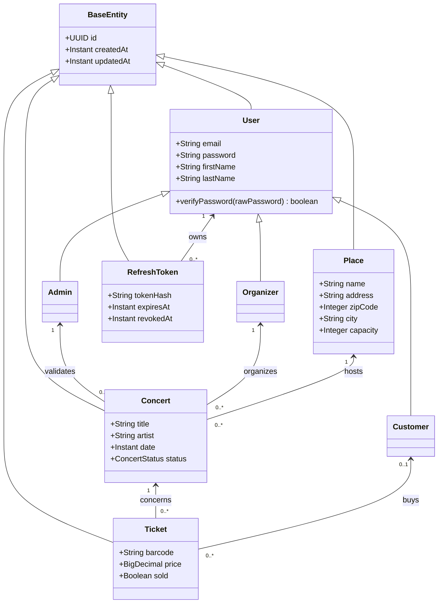

# SIR Backend - Version 1

## 1) Resume de l'etat du projet (accompli / pas accompli)

### Synthese par consigne de rendu

| Consigne | Statut | Preuves (fichiers) | Commentaire |
|---|---|---|---|
| MOR (entites) fonctionnel | Accompli | `src/main/java/jpa/entities/` | Entites JPA definies et utilisees par les services actifs (`User`, `Concert`, `Place`, `Ticket`, `RefreshToken`, etc.). |
| Au moins un heritage | Accompli | `src/main/java/jpa/entities/User.java`, `src/main/java/jpa/entities/Admin.java`, `src/main/java/jpa/entities/Organizer.java`, `src/main/java/jpa/entities/Customer.java` | Heritage `SINGLE_TABLE` sur `User` avec discriminants. |
| Au moins une relation bidirectionnelle (`mappedBy`) | Accompli | `src/main/java/jpa/entities/Concert.java`, `src/main/java/jpa/entities/Ticket.java`, `src/main/java/jpa/entities/Admin.java`, `src/main/java/jpa/entities/Organizer.java`, `src/main/java/jpa/entities/Customer.java` | Ex: `Concert` <-> `Ticket` (`@OneToMany(mappedBy = "concert")` / `@ManyToOne`). |
| Une DAO par entite | Accompli (pour toutes les entites concretes) | `src/main/java/jpa/dao/abstracts/` + `src/main/java/jpa/dao/impl/` | DAOs presentes pour `User`, `Admin`, `Organizer`, `Customer`, `Concert`, `Ticket`, `Place`, `RefreshToken`. |
| Au moins une requete JPQL | Accompli | `src/main/java/jpa/dao/impl/ConcertDaoImpl.java`, `src/main/java/jpa/dao/impl/TicketDaoImpl.java`, `src/main/java/jpa/dao/impl/UserDaoImpl.java` | Ex: `findByStatus`, `findByPriceLowerThan`, `findByEmail`. |
| Au moins une requete nommee | Accompli | `src/main/java/jpa/entities/Ticket.java`, `src/main/java/jpa/dao/impl/TicketDaoImpl.java` | `@NamedQuery(name="Ticket.findAvailable", ...)` + usage dans DAO. |
| Au moins une Criteria Query | Accompli | `src/main/java/jpa/dao/impl/ConcertDaoImpl.java` | Methode `findConcertsByDateRange(...)`. |
| Au moins une DAO avec methodes metier (pas juste CRUD) | Accompli | `src/main/java/jpa/dao/abstracts/ConcertDao.java`, `src/main/java/jpa/dao/impl/ConcertDaoImpl.java` | Methode metier `existsPlaceBookingConflict(...)`. |
| Un controller par entite | Partiellement accompli | `src/main/java/jpa/controllers/` | Controllers existants pour `User`, `Concert`, `Admin`, `Organizer`, `Place`, `Ticket`, `Auth`. Manquent `CustomerController` et `RefreshTokenController` dedies. |
| OpenAPI complete sur au moins un controller | Accompli | `src/main/java/jpa/controllers/ConcertController.java`, `src/main/java/jpa/controllers/UserController.java`, `src/main/java/jpa/controllers/AuthController.java` | Annotations `@Operation`, `@ApiResponses`, schemas DTO. |
| Au moins un controller avec endpoints metier | Accompli | `src/main/java/jpa/controllers/ConcertController.java`, `src/main/java/jpa/controllers/AuthController.java` | Validation de concert, filtrage pending/public, login/refresh/logout. |
| Au moins un controller utilisant un DTO | Accompli | `src/main/java/jpa/controllers/UserController.java`, `src/main/java/jpa/controllers/ConcertController.java`, `src/main/java/jpa/controllers/AuthController.java` | DTO requests/responses utilises partout sur ces APIs. |
| Documentation explicite du modele, diagramme, endpoints | Accompli avec ce README | `README.md` | Cette documentation couvre les points demandes. |

### Points non completement accomplis (a traiter ensuite)

1. Tous les controllers ne sont pas exposes dans l'application REST.
`src/main/java/jpa/TestApplication.java` enregistre `AuthController`, `UserController`, `ConcertController`, `SwaggerUiController`, mais pas `AdminController`, `OrganizerController`, `PlaceController`, `TicketController`.
2. Certains controllers sont des squelettes (pas d'endpoints metier/CRUD).
`src/main/java/jpa/controllers/OrganizerController.java`, `src/main/java/jpa/controllers/PlaceController.java`, `src/main/java/jpa/controllers/TicketController.java`.
3. Il n'existe pas encore de controller dedie pour toutes les entites concretes (`Customer`, `RefreshToken`) si on interprete strictement "un controller par entite".

---

## 2) Details explicites de ce qui est fait

## Modele metier (vision fonctionnelle)

Le backend gere principalement:

1. Inscription des utilisateurs (customer, organizer, admin).
2. Authentification (login + access token JWT + refresh token avec rotation).
3. Gestion des concerts:
   - creation par organisateur,
   - validation par admin,
   - publication/publication en attente.
4. Gestion de lieux (`Place`) avec initialisation de 20 salles francaises au demarrage.

### Regles metier deja implementees

1. Un concert cree est en `PENDING_VALIDATION`.
`src/main/java/jpa/services/impl/ConcertServiceImpl.java`
2. Un concert ne peut etre valide que si son statut est `PENDING_VALIDATION`.
`src/main/java/jpa/services/impl/ConcertServiceImpl.java`
3. Un lieu ne peut pas etre reserve sur un creneau deja occupe (fenetre de 3 heures).
`src/main/java/jpa/services/impl/ConcertServiceImpl.java`
`src/main/java/jpa/dao/impl/ConcertDaoImpl.java`
4. Le refresh token est rotate a chaque refresh (ancien token revoke, nouveau token genere).
`src/main/java/jpa/services/impl/AuthServiceImpl.java`
5. La creation de concert genere automatiquement des tickets selon `ticketUnitPrice` et `ticketQuantity`.
`src/main/java/jpa/services/impl/ConcertServiceImpl.java`

---

## Partie JPA (consignes)

### Entites (MOR)

Dossier: `src/main/java/jpa/entities/`

Entites principales:

1. `BaseEntity` (id UUID + timestamps).
2. `User` (abstraite) + sous-types `Admin`, `Organizer`, `Customer`.
3. `Concert`.
4. `Ticket`.
5. `Place`.
6. `RefreshToken`.

### Heritage

1. `User` utilise `@Inheritance(strategy = InheritanceType.SINGLE_TABLE)`.
2. Sous-types:
   - `Admin` (`@DiscriminatorValue("ADMIN")`)
   - `Organizer` (`@DiscriminatorValue("ORGANIZER")`)
   - `Customer` (`@DiscriminatorValue("CUSTOMER")`)

Fichiers:

1. `src/main/java/jpa/entities/User.java`
2. `src/main/java/jpa/entities/Admin.java`
3. `src/main/java/jpa/entities/Organizer.java`
4. `src/main/java/jpa/entities/Customer.java`

### Relations bidirectionnelles (mappedBy)

1. `Concert` -> `Ticket` (1..n) et `Ticket` -> `Concert` (n..1).
2. `Admin` -> `Concert` (1..n) et `Concert` -> `Admin` (n..1).
3. `Organizer` -> `Concert` (1..n) et `Concert` -> `Organizer` (n..1).
4. `Customer` -> `Ticket` (1..n) et `Ticket` -> `Customer` (n..1).

Fichiers:

1. `src/main/java/jpa/entities/Concert.java`
2. `src/main/java/jpa/entities/Ticket.java`
3. `src/main/java/jpa/entities/Admin.java`
4. `src/main/java/jpa/entities/Organizer.java`
5. `src/main/java/jpa/entities/Customer.java`

---

## Partie DAO (consignes)

### Une DAO par entite

Dossiers:

1. Abstractions: `src/main/java/jpa/dao/abstracts/`
2. Implementations: `src/main/java/jpa/dao/impl/`

Paires abstraction/implementation:

1. `UserDao` / `UserDaoImpl`
2. `AdminDao` / `AdminDaoImpl`
3. `OrganizerDao` / `OrganizerDaoImpl`
4. `CustomerDao` / `CustomerDaoImpl`
5. `ConcertDao` / `ConcertDaoImpl`
6. `TicketDao` / `TicketDaoImpl`
7. `PlaceDao` / `PlaceDaoImpl`
8. `RefreshTokenDao` / `RefreshTokenDaoImpl`

### Requetes exigees

1. JPQL:
   - `ConcertDaoImpl.findByStatus(...)`
   - `TicketDaoImpl.findByPriceLowerThan(...)`
   - `UserDaoImpl.findByEmail(...)`
2. Requete nommee:
   - declaration: `Ticket` avec `@NamedQuery(name="Ticket.findAvailable", ...)`
   - usage: `TicketDaoImpl.findAvailableTickets()`
3. Criteria Query:
   - `ConcertDaoImpl.findConcertsByDateRange(...)`

### Methodes metier en DAO

1. `ConcertDao.existsPlaceBookingConflict(...)` pour la collision de reservation de salle.
2. `RefreshTokenDao.findValidByHash(...)` pour filtrer les refresh tokens actifs/non expires.

---

## Partie REST API (consignes)

### Controllers existants

Dossier: `src/main/java/jpa/controllers/`

1. `AuthController`
2. `UserController`
3. `ConcertController`
4. `AdminController`
5. `OrganizerController` (squelette)
6. `PlaceController` (squelette)
7. `TicketController` (squelette)
8. `SwaggerUiController`
9. `OpenApiAliasController`

### Controllers effectivement exposes

Fichier: `src/main/java/jpa/TestApplication.java`

Enregistres:

1. `AuthController`
2. `UserController`
3. `ConcertController`
4. `SwaggerUiController`
5. `OpenApiAliasController`
6. `OpenApiResource` (generation spec OpenAPI)

Composants de securite enregistres:

1. `JwtAuthorizationFilter` (authentification Bearer JWT)
2. `RoleBasedSecurityFeature` (prise en charge `@RolesAllowed` / `@PermitAll`)

### Endpoints metier deja disponibles

#### Auth

1. `POST /auth/login` (public)
2. `POST /auth/refresh` (public)
3. `POST /auth/logout` (prive: `ROLE_ADMIN`, `ROLE_ORGANIZER`, `ROLE_CUSTOMER`)

Controller:
`src/main/java/jpa/controllers/AuthController.java`

Service:
`src/main/java/jpa/services/impl/AuthServiceImpl.java`

#### Users

1. `POST /users/register` (public)
2. `POST /users/register/admin` (prive: `ROLE_ADMIN` + header `X-Admin-Registration-Key`)

Controller:
`src/main/java/jpa/controllers/UserController.java`

Service:
`src/main/java/jpa/services/impl/UserRegistrationServiceImpl.java`

#### Concerts

1. `POST /concerts/create` (prive: `ROLE_ORGANIZER`)
2. `POST /concerts/{concertId}/validate` (prive: `ROLE_ADMIN`)
3. `GET /concerts/public` (public)
4. `GET /concerts/pending` (prive: `ROLE_ADMIN`)

Controller:
`src/main/java/jpa/controllers/ConcertController.java`

Service:
`src/main/java/jpa/services/impl/ConcertServiceImpl.java`

### Matrice d'acces public/prive (etat actuel implemente)

Pour tous les endpoints prives, il faut fournir:

1. `Authorization: Bearer <access_token>`
2. un token non expire et signe avec la cle JWT backend

| Methode | Endpoint | Acces | Conditions supplementaires | Fichier |
|---|---|---|---|---|
| POST | `/auth/login` | Public (`@PermitAll`) | Aucune | `src/main/java/jpa/controllers/AuthController.java` |
| POST | `/auth/refresh` | Public (`@PermitAll`) | Aucune | `src/main/java/jpa/controllers/AuthController.java` |
| POST | `/auth/logout` | Prive (`@RolesAllowed`) | Role: `ROLE_ADMIN` ou `ROLE_ORGANIZER` ou `ROLE_CUSTOMER` | `src/main/java/jpa/controllers/AuthController.java` |
| POST | `/users/register` | Public (`@PermitAll`) | Aucune | `src/main/java/jpa/controllers/UserController.java` |
| POST | `/users/register/admin` | Prive (`@RolesAllowed`) | Role `ROLE_ADMIN` + `X-Admin-Registration-Key` | `src/main/java/jpa/controllers/UserController.java` |
| POST | `/concerts/create` | Prive (`@RolesAllowed`) | Role `ROLE_ORGANIZER` | `src/main/java/jpa/controllers/ConcertController.java` |
| POST | `/concerts/{concertId}/validate` | Prive (`@RolesAllowed`) | Role `ROLE_ADMIN` | `src/main/java/jpa/controllers/ConcertController.java` |
| GET | `/concerts/public` | Public (`@PermitAll`) | Aucune | `src/main/java/jpa/controllers/ConcertController.java` |
| GET | `/concerts/pending` | Prive (`@RolesAllowed`) | Role `ROLE_ADMIN` | `src/main/java/jpa/controllers/ConcertController.java` |

### Securite JWT: implementation technique

Fichiers principaux:

1. DTO claims: `src/main/java/jpa/dto/security/AccessTokenClaimsDto.java`
2. Interface token: `src/main/java/jpa/security/interfaces/AccessTokenService.java`
3. Implementation token: `src/main/java/jpa/security/impl/AccessTokenServiceImpl.java`
4. Filtre d'autorisation: `src/main/java/jpa/security/JwtAuthorizationFilter.java`
5. Enregistrement du filtre/feature RESTEasy: `src/main/java/jpa/TestApplication.java`

Points techniques:

1. Le JWT access token est signe en `HS256`.
2. Le filtre lit `Authorization: Bearer ...`, verifie signature + claims (`iss`, `sub`, `email`, `role`, `iat`, `exp`).
3. Le `SecurityContext` JAX-RS est alimente pour que `@RolesAllowed` fonctionne sur les endpoints.
4. Les endpoints publics restent accessibles sans token (`@PermitAll`).

### Utilisation de DTO (consigne)

Exemples:

1. `CreateConcertRequestDto`, `ResponseConcertDetailsDto`
2. `CreateUserRequestDto`, `CreateAdminRequestDto`, `ResponseUserDto`
3. `LoginRequestDto`, `RefreshTokenRequestDto`, `TokenPairResponseDto`

Dossiers:

1. `src/main/java/jpa/dto/concert/`
2. `src/main/java/jpa/dto/user/`
3. `src/main/java/jpa/dto/auth/`
4. `src/main/java/jpa/dto/security/`

### OpenAPI / Swagger

1. URL UI: `http://localhost:8081/docs`
2. Spec JSON: `http://localhost:8081/openapi.json`
3. Alias: `http://localhost:8081/openapi` (redirect)

Fichiers:

1. `src/main/java/jpa/controllers/SwaggerUiController.java`
2. `src/main/java/jpa/controllers/OpenApiAliasController.java`
3. `src/main/java/jpa/TestApplication.java`

---

## Configuration et execution

### Prerequis

1. Java 17+
2. Maven 3.9+
3. HSQLDB lance (serveur externe utilise par `persistence.xml`)

### Variables d'environnement

Fichier exemple: `.env`

Variables:

1. `APP_ADMIN_REGISTRATION_KEY`
2. `APP_AUTH_JWT_SIGNING_KEY`
3. `APP_AUTH_ACCESS_TOKEN_TTL_SECONDS`
4. `APP_AUTH_REFRESH_TOKEN_TTL_SECONDS`
5. `APP_TICKET_MAX_BATCH_SIZE`

### Lancer la base HSQLDB

Windows:

```bat
run-hsqldb-server.bat
```

Linux/macOS:

```bash
./run-hsqldb-server.sh
```

### Lancer le backend

1. Build:

```bash
mvn clean compile
```

2. Lancer la classe main:
`src/main/java/jpa/RestServer.java`

Au demarrage:

1. Les 20 salles de reference sont seed automatiquement si `places` est vide.
Fichier: `src/main/java/jpa/config/ReferenceDataInitializer.java`

---

## Exemples d'utilisation API

### Inscription publique

```bash
curl -X POST http://localhost:8081/users/register \
  -H "Content-Type: application/json" \
  -d "{\"email\":\"orga@example.com\",\"password\":\"myStrongPass123\",\"firstName\":\"Jean\",\"lastName\":\"Dupont\",\"role\":\"ORGANIZER\"}"
```

### Login

```bash
curl -X POST http://localhost:8081/auth/login \
  -H "Content-Type: application/json" \
  -d "{\"email\":\"orga@example.com\",\"password\":\"myStrongPass123\"}"
```

### Refresh token

```bash
curl -X POST http://localhost:8081/auth/refresh \
  -H "Content-Type: application/json" \
  -d "{\"refreshToken\":\"<refresh_token>\"}"
```

### Creation concert

```bash
curl -X POST http://localhost:8081/concerts/create \
  -H "Authorization: Bearer <access_token_organizer>" \
  -H "Content-Type: application/json" \
  -d "{\"title\":\"Live Rennes\",\"artist\":\"Band X\",\"date\":\"2026-06-15T20:00:00Z\",\"organizerId\":\"<uuid>\",\"placeId\":\"<uuid>\",\"ticketUnitPrice\":49.90,\"ticketQuantity\":500}"
```

### Validation concert (admin)

```bash
curl -X POST http://localhost:8081/concerts/<concert_uuid>/validate \
  -H "Authorization: Bearer <access_token_admin>" \
  -H "Content-Type: application/json"
```

### Logout (session courante)

```bash
curl -X POST http://localhost:8081/auth/logout \
  -H "Authorization: Bearer <access_token>" \
  -H "Content-Type: application/json" \
  -d "{\"refreshToken\":\"<refresh_token>\"}"
```

---

## Diagramme de classes (modele metier)



---

## Backlog conseille pour la suite (V2)

1. Ajouter `CustomerController` et eventuellement `RefreshTokenController` dedie si exigence stricte "1 controller par entite".
2. Rendre `AdminController`, `OrganizerController`, `PlaceController`, `TicketController` vraiment fonctionnels (endpoints CRUD + metier).
3. Enregistrer ces controllers dans `TestApplication`.
4. Etendre la politique d'autorisation (roles) aux futurs controllers quand ils seront exposes.
5. Ajouter des tests d'integration REST couvrant aussi les cas `401`/`403`.
